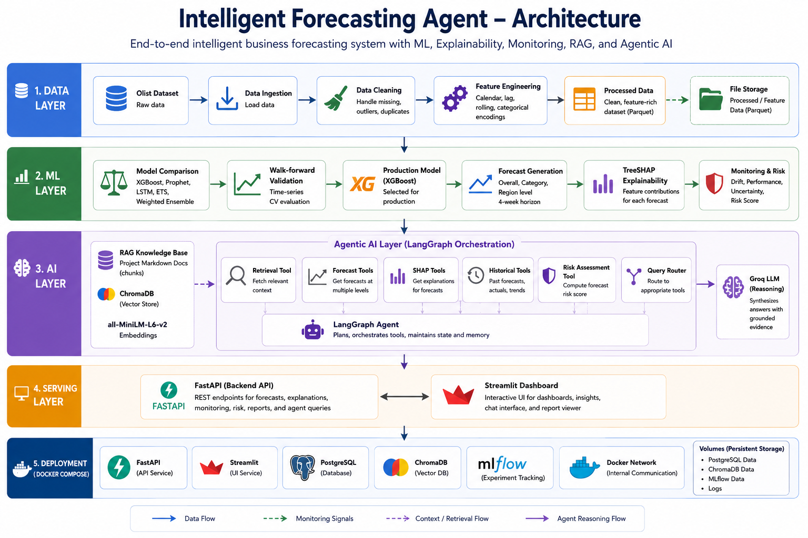
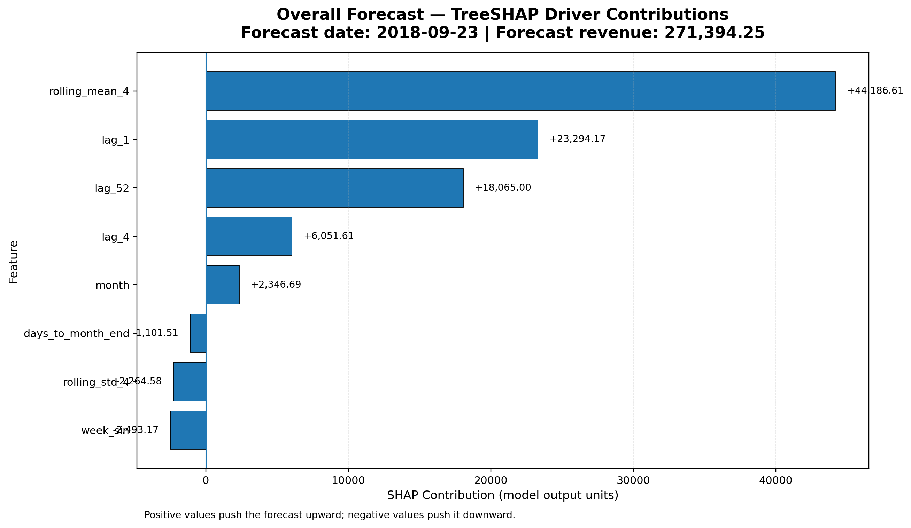
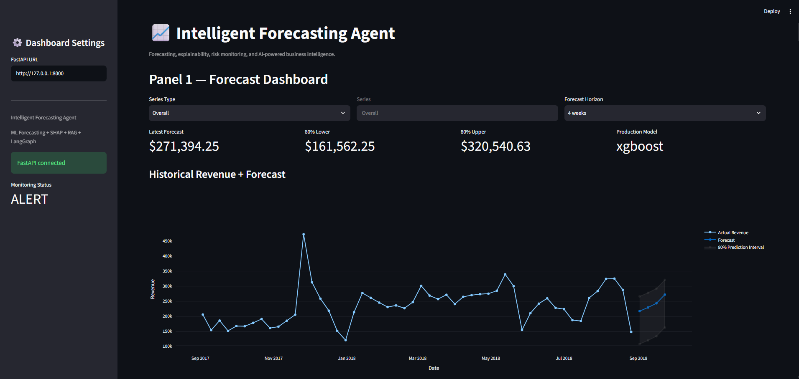
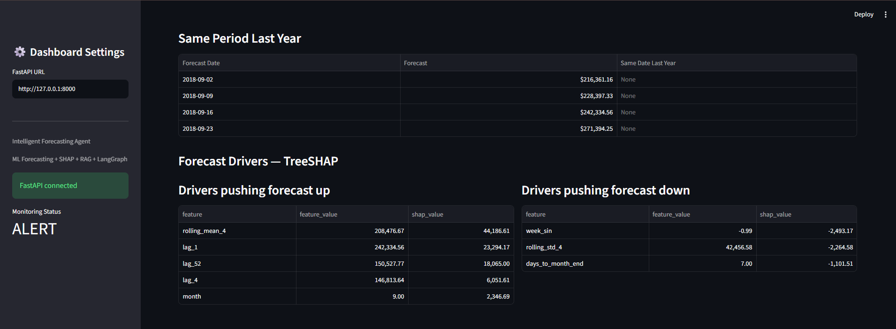
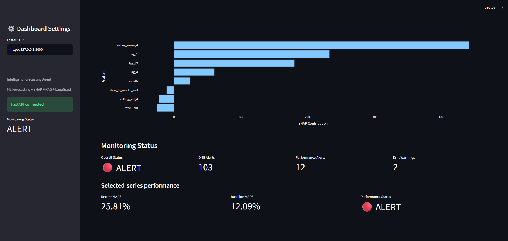
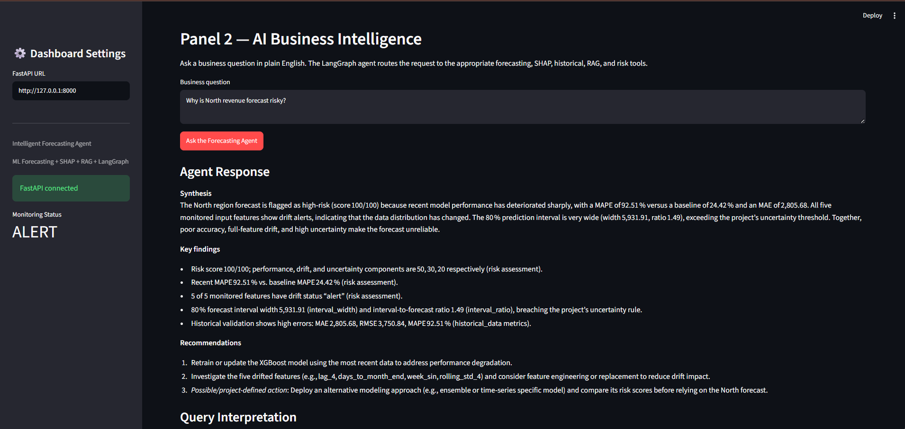
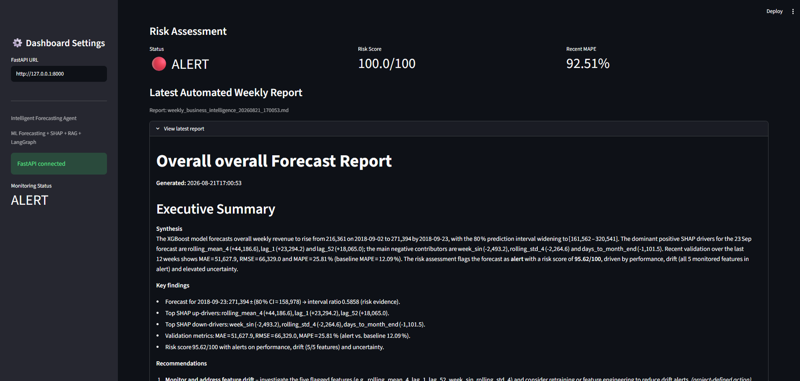

# Intelligent Forecasting Agent

An end-to-end intelligent business forecasting system combining predictive machine learning, TreeSHAP explainability, model monitoring, retrieval-augmented generation (RAG), LangGraph agent orchestration, and an LLM-powered business intelligence interface.

---

## Badges


> Additional badges such as license and deployment status can be added once the project is published.

---

## Demo / Local Execution

The project is available for local execution using the provided Python and Docker Compose setup.

The Streamlit dashboard and FastAPI serving layer have been validated locally, including the Dockerized end-to-end serving tests.

---

## Overview / Problem Statement

Business forecasting systems often provide a numerical prediction without giving decision-makers enough context to understand how reliable that prediction is or why the model produced it.

This project builds an end-to-end intelligent forecasting system that combines forecasting, explainability, monitoring, retrieval, and agentic reasoning into a single workflow.

The system forecasts weekly revenue at three levels:

- Overall revenue
- Business category
- Geographic region

The forecasting pipeline evaluates multiple models using walk-forward validation and uses a production XGBoost model for the deployed forecasting workflow.

The system then extends the forecasting pipeline with:

- TreeSHAP explanations for forecast drivers
- Feature-drift monitoring
- Model-performance monitoring
- Forecast-risk assessment
- Project-derived RAG context
- Historical forecast analysis
- LangGraph-based tool orchestration
- Groq-powered reasoning and synthesis
- Automated business reports
- FastAPI REST endpoints
- Streamlit dashboard
- Docker Compose infrastructure

The objective is not only to forecast revenue, but also to answer business questions such as:

```text
Why is North revenue forecast risky?
```

---

## Architecture Diagram



The architecture shows the complete flow from Olist data ingestion and forecasting through TreeSHAP explainability, monitoring, RAG-based context retrieval, LangGraph agent orchestration, FastAPI/Streamlit serving, and Docker Compose deployment.

## Key Features

### Revenue Forecasting

- Weekly revenue forecasting at overall, category, and regional levels.
- Production forecasting using XGBoost.
- Four-week forecast horizon with 80% prediction intervals.
- Walk-forward validation for model evaluation.

### Model Explainability

- TreeSHAP-based local forecast explanations.
- Identification of features pushing forecasts upward or downward.
- Feature-level contribution values for individual forecasts.

### Model Monitoring

- Data-drift detection using statistical drift measures.
- Recent versus baseline model-performance monitoring.
- Forecast uncertainty monitoring.
- Project-defined forecast-risk scoring.

### AI Business Intelligence

- Natural-language business queries.
- LangGraph-based tool orchestration.
- Grounded reasoning over verified project evidence.
- Groq-powered LLM synthesis.
- Evidence-based recommendations.

### Retrieval-Augmented Generation

- Project-derived Markdown knowledge base.
- ChromaDB vector storage.
- `all-MiniLM-L6-v2` embeddings.
- Retrieval of relevant forecasting and monitoring context.

### Automated Reporting

- Automated weekly business intelligence reports.
- Forecast, SHAP, historical performance, monitoring, risk, and context sections.
- Downloadable PDF reports through the dashboard.

### Production Serving

- FastAPI REST API.
- Streamlit interactive dashboard.
- Docker Compose orchestration.
- PostgreSQL, ChromaDB, and MLflow service containers.

---

## Tech Stack

| Layer | Technologies |
|---|---|
| Programming Language | Python 3.11 |
| Data Processing | Pandas, NumPy, PyArrow |
| Data Validation | Project data-quality pipeline |
| Machine Learning | XGBoost, Scikit-learn |
| Time-Series Models | Prophet, Statsmodels, Exponential Smoothing |
| Explainability | SHAP / TreeSHAP |
| Experiment Tracking | MLflow |
| Embeddings | Sentence Transformers |
| Vector Database | ChromaDB |
| Agent Framework | LangGraph |
| LLM | Groq — `openai/gpt-oss-120b` |
| Backend | FastAPI, Uvicorn |
| Frontend | Streamlit |
| Visualization | Plotly, Matplotlib |
| Reporting | ReportLab |
| Containerization | Docker, Docker Compose |

---

## Repository Structure

```text
intelligent-forecasting-agent/
│
├── data/
│   ├── raw/
│   ├── processed/
│   ├── features/
│   ├── knowledge_base/
│   └── vector_store/
│
├── notebooks/
│
├── reports/
│   ├── data_quality/
│   ├── monitoring/
│   ├── secondary/
│   ├── shap/
│   └── weekly_reports/
│
├── mlruns/
│
├── src/
│   ├── data_layer/
│   │   ├── ingestion.py
│   │   ├── cleaning.py
│   │   ├── feature_engineering.py
│   │   └── pipeline.py
│   │
│   ├── ml_layer/
│   │   ├── training.py
│   │   ├── secondary_training.py
│   │   ├── evaluation.py
│   │   ├── explainability.py
│   │   ├── monitoring.py
│   │   └── models/
│   │
│   ├── ai_layer/
│   │   ├── state.py
│   │   ├── tools.py
│   │   ├── agent.py
│   │   ├── query_router.py
│   │   ├── reasoning.py
│   │   ├── llm.py
│   │   ├── rag_index.py
│   │   ├── rag_tools.py
│   │   ├── forecast_tools.py
│   │   ├── historical_tools.py
│   │   ├── shap_tools.py
│   │   ├── risk_tools.py
│   │   ├── report_tools.py
│   │   ├── production_forecast.py
│   │   └── weekly_report.py
│   │
│   └── serving/
│       ├── api.py
│       ├── schemas.py
│       ├── dashboard.py
│       ├── api_test.py
│       └── e2e_test.py
│
├── Dockerfile.api
├── Dockerfile.dashboard
├── docker-compose.yml
├── requirements.txt
├── requirements-serving.txt
├── .env.example
├── .gitignore
└── README.md
```

---

## Dataset

This project uses the **Brazilian E-Commerce Public Dataset by Olist**.

The raw Olist CSV files are intentionally excluded from Git.

Place the downloaded dataset files inside:

```text
data/raw/
```

---

## Methodology / Approach

The project is implemented as a layered end-to-end forecasting and business-intelligence system consisting of the **Data Layer**, **ML Layer**, and **AI / Decision Layer**, followed by the Serving Layer for user interaction.

### Data Layer

The Data Layer converts the raw Olist e-commerce data into clean, validated, and feature-engineered datasets.

```text
Raw Olist Dataset
        ↓
Data Ingestion
        ↓
Data Cleaning & Validation
        ↓
Feature Engineering
        ↓
Processed Dataset
        ↓
Forecasting Feature Dataset
```

The main stages include:

- Data ingestion from the Olist dataset
- Data cleaning and validation
- Transformation of raw transactional data
- Feature engineering for weekly revenue forecasting
- Generation of the processed dataset
- Generation of the canonical forecasting feature dataset

The resulting forecasting features are passed to the ML Layer for model training, validation, and forecasting.

### ML Layer

The ML Layer develops and evaluates forecasting models using the project's walk-forward validation methodology.

```text
Forecasting Feature Dataset
            ↓
       Model Training
            ↓
   Walk-forward Validation
            ↓
      Model Comparison
            ↓
   Production Model Selection
            ↓
      Forecast Generation
```

The project evaluates multiple forecasting approaches and compares their forecasting performance using historical validation results.

The selected production forecasting workflow uses XGBoost.

The ML Layer also provides:

- Forecast generation
- Walk-forward validation
- Model-performance evaluation
- Multi-model comparison
- Production model artifacts
- TreeSHAP explainability
- Feature-drift monitoring
- Model-performance monitoring
- Forecast uncertainty information

TreeSHAP explanations identify the features contributing positively or negatively to individual forecasts.

Monitoring outputs are used by the AI Layer to assess forecast reliability and calculate the project's defined forecast-risk score.

### AI / Decision Layer

The AI Layer converts the verified outputs produced by the ML and monitoring components into an interactive business-intelligence workflow.

```text
Natural-language Business Query
              ↓
         Query Router
              ↓
        Tool Selection
              ↓
 ┌────────────┼─────────────┐
 ↓            ↓             ↓
Forecast     SHAP       Historical
Tool         Tool          Tool
 ↓            ↓             ↓
 └────────────┼─────────────┘
              ↓
       RAG / Business Context
              ↓
        Risk Assessment
              ↓
       Verified Evidence
              ↓
       LangGraph Reasoning
              ↓
        Groq LLM Synthesis
              ↓
       Business Response
```

The agent can route business questions to the appropriate tools, including:

- Latest forecast retrieval
- TreeSHAP explanation retrieval
- Historical forecast-performance analysis
- Project-derived RAG retrieval
- Forecast-risk assessment
- Automated report generation

The AI Layer combines the retrieved evidence and passes it to the reasoning node.

The reasoning layer uses LangGraph for orchestration and Groq for LLM-based synthesis.

The reasoning prompt enforces grounding rules so that the model:

- Does not invent numerical values, forecasts, metrics, dates, or sources
- Does not invent external business facts or industry benchmarks
- Distinguishes production forecasts from historical validation evidence
- Treats SHAP values as additive model-output contributions rather than percentages
- Represents risk scores as X/100
- Explicitly identifies missing evidence
- Ties recommendations to supplied project evidence

### End-to-End Intelligent Forecasting Flow

The complete methodology can therefore be summarized as:

```text
Olist Dataset
      ↓
Data Ingestion
      ↓
Cleaning & Validation
      ↓
Feature Engineering
      ↓
Forecasting Features
      ↓
Machine Learning Models
      ↓
Walk-forward Validation
      ↓
Model Comparison
      ↓
Production XGBoost
      ↓
Forecast + SHAP + Monitoring
      ↓
AI Agent
      ↓
Query Routing
      ↓
Forecast / SHAP / Historical / RAG / Risk Tools
      ↓
Verified Evidence
      ↓
LangGraph Reasoning
      ↓
Groq LLM
      ↓
Business Intelligence Response
      ↓
FastAPI + Streamlit
```

---

## Model Performance / Results

The forecasting pipeline evaluates five approaches using the project's walk-forward validation framework.

### Overall Model Comparison

| Rank | Model | Mean MAE | Mean RMSE | Mean MAPE | Interval Coverage |
|---:|---|---:|---:|---:|---:|
| 1 | LSTM | 37,281.36 | 43,829.29 | 16.11% | 81.25% |
| 2 | Weighted Ensemble | 36,602.59 | 43,384.53 | 17.23% | 75.00% |
| 3 | Exponential Smoothing | 42,570.13 | 50,412.82 | 19.76% | 68.75% |
| 4 | Prophet | 44,045.20 | 50,923.09 | 20.24% | 46.88% |
| 5 | XGBoost | 41,257.86 | 50,268.34 | 20.41% | 81.25% |

The validation ranking and the production-model choice are separate project decisions; the production serving workflow uses XGBoost.

### Production Forecast Model

The deployed production forecasting workflow uses **XGBoost**.

The production model generates four-week revenue forecasts together with 80% prediction intervals.

The latest stored overall production forecast is:

| Forecast Date | Forecast Revenue | Lower 80% | Upper 80% |
|---|---:|---:|---:|
| 2018-09-02 | 216,361.16 | 106,529.15 | 265,507.54 |
| 2018-09-09 | 228,397.33 | 118,565.32 | 277,543.71 |
| 2018-09-16 | 242,334.56 | 132,502.56 | 291,480.94 |
| 2018-09-23 | 271,394.25 | 161,562.25 | 320,540.63 |

The model-comparison results and production forecast are stored in the project's `reports/` artifacts.

---

## SHAP Explainability

The production XGBoost forecasting workflow uses **TreeSHAP** to explain individual predictions.

SHAP values represent additive contributions to the model prediction in the model's output units. They are not percentages.

For the overall forecast dated **2018-09-23**, the main features pushing the prediction upward were:

| Feature | Feature Value | SHAP Contribution |
|---|---:|---:|
| `rolling_mean_4` | 208,476.67 | +44,186.61 |
| `lag_1` | 242,334.56 | +23,294.17 |
| `lag_52` | 150,527.77 | +18,065.00 |
| `lag_4` | 146,813.64 | +6,051.61 |
| `month` | 9.00 | +2,346.69 |

The main features pushing the forecast downward were:

| Feature | Feature Value | SHAP Contribution |
|---|---:|---:|
| `week_sin` | -0.9927 | -2,493.17 |
| `rolling_std_4` | 42,456.58 | -2,264.58 |
| `days_to_month_end` | 7.00 | -1,101.51 |

The model's base value for this explanation was **180,355.19**, resulting in a final forecast of **271,394.25** after the feature contributions were applied.

### SHAP Visualizations

The project includes SHAP-related artifacts under:

```text
reports/shap/
```

including:

- Global feature importance
- Overall local explanations
- Secondary local explanations
- SHAP summary data
- Top forecast drivers
- Agent-facing SHAP explanations

### SHAP Visualization



The visualization shows the TreeSHAP contributions for the overall revenue forecast dated 2018-09-23. Positive contributions push the forecast upward, while negative contributions push it downward.

---

## Sample Agent Interaction

The AI business-intelligence interface accepts natural-language questions and routes them through the LangGraph agent.

### Example Query

```text
Why is North revenue forecast risky?
```

### Query Routing

- Request Type: risk
- Series Type: region
- Series ID: North
- Forecast Horizon: 4
- Comparison Period: 12 weeks

The agent activates the relevant evidence sources:

```text
Forecast       ✓
SHAP           ✓
Historical     ✓
Business RAG   ✓
Risk           ✓
```

### Example Result

The North-region forecast is assigned a project-defined risk score of:

```text
100/100
```

The risk assessment reports:

```text
Performance status:  alert
Drift status:       alert
Recent MAPE:        92.51%
Baseline MAPE:      24.42%
Drift alerts:       5/5 monitored features
Interval ratio:     1.4888
```

The agent uses these verified outputs together with TreeSHAP and historical forecast evidence to produce a business-oriented synthesis and recommendations.

For the 2018-09-23 North forecast, the strongest downward SHAP contributors include:

```text
lag_4                -760.50
days_to_month_end    -555.49
week_sin             -198.60
```

The agent response is generated by the project's LangGraph reasoning workflow using the configured Groq model.

---

## Setup & Installation

### Prerequisites

Install the following before running the project locally:

- Python 3.11
- Git
- Docker Desktop and Docker Compose for containerized execution

### Clone the Repository

```powershell
git clone https://github.com/omhunagund/intelligent-forecasting-agent.git
cd intelligent-forecasting-agent
```

### Create a Virtual Environment

```powershell
python -m venv .venv
```

Activate the environment on Windows PowerShell:

```powershell
.\.venv\Scripts\Activate.ps1
```

### Install Dependencies

For the complete development and ML environment:

```powershell
python -m pip install -r requirements.txt
```

The Docker serving images use the lighter `requirements-serving.txt` environment.

### Prepare the Dataset

Place the Olist CSV files inside:

```text
data/raw/
```

The project can then be run through its existing data, ML, AI, and serving workflows.

---

## Environment Variables

Create a local `.env` file in the project root using the provided template:

```powershell
Copy-Item .env.example .env
```

The `.env` file contains secrets and must not be committed to Git.

Use `.env.example` as the configuration template.

### Groq API Key

The AI reasoning layer requires a Groq API key:

```text
GROQ_API_KEY=your_groq_api_key
```

Open the `.env` file and replace `your_groq_api_key` with your actual Groq API key.

The application loads the key from the environment when initializing the Groq reasoning model.

### Environment Template

The repository contains `.env.example` as the example configuration file.

Do not place the real API key in `.env.example`.

A local `.env` file should contain the actual secret value.

---

## How to Run

The project can be run either locally or through Docker Compose.

### Option 1 — Run Locally

Activate the Python virtual environment:

```powershell
.\.venv\Scripts\Activate.ps1
```

Start the FastAPI backend:

```powershell
python -m uvicorn src.serving.api:app --host 127.0.0.1 --port 8000
```

The API will be available at `http://localhost:8000`, with interactive API documentation at `http://localhost:8000/docs`.

In a separate terminal, start the Streamlit dashboard:

```powershell
python -m streamlit run src/serving/dashboard.py
```

The dashboard will be available at `http://localhost:8501`.

### Option 2 — Run with Docker Compose

Make sure Docker Desktop is running.

Build the application images:

```powershell
docker compose build api dashboard
```

Start the complete application stack:

```powershell
docker compose up -d
```

Check the running services:

```powershell
docker compose ps
```

The main services are exposed at:

```text
FastAPI       http://localhost:8000
Streamlit     http://localhost:8501
MLflow        http://localhost:5000
ChromaDB      http://localhost:8001
PostgreSQL    localhost:5432
```

Stop the Docker Compose stack:

```powershell
docker compose down
```

### Validate the Serving Layer

The project includes automated serving tests.

Run the FastAPI serving tests:

```powershell
python -m src.serving.api_test
```

Run the Dockerized end-to-end integration test while the Compose stack is running:

```powershell
python -m src.serving.e2e_test
```

The end-to-end test validates:

- Health endpoint
- Forecast endpoint
- SHAP endpoint
- Agent query endpoint
- Latest report endpoint

The final Dockerized serving E2E test passed successfully.

---

## Screenshots

The Streamlit dashboard provides an interactive interface for exploring forecasts, explanations, monitoring signals, AI-generated business insights, and automated reports.

### Forecast Dashboard

The forecast dashboard provides an overview of the selected revenue series, forecast horizon, historical values, and prediction intervals.



### Explainability

The explainability view presents the TreeSHAP drivers behind the selected forecast, including the features pushing the prediction upward or downward.



### Monitoring & Risk

The monitoring view surfaces model-performance status, feature-drift signals, forecast uncertainty, and project-defined forecast risk.



### AI Business Intelligence

The AI interface accepts natural-language business questions and returns a grounded synthesis based on forecast, SHAP, historical, RAG, and risk evidence.

Example query:

```text
Why is North revenue forecast risky?
```



### Weekly Business Report

The reporting view provides the generated business-intelligence report containing forecast results, explainability, historical performance, risk assessment, retrieved context, and recommendations.



---

## Known Limitations / Future Work

### Current Limitations

- The forecasting dataset and historical validation artifacts represent the project's available data period and should not be interpreted as live current-market forecasts.
- Production forecasts are model outputs and should not be treated as guaranteed future revenue.
- Historical validation evidence is kept separate from production forecasting evidence.
- Forecast-risk thresholds are project-defined rules rather than external industry standards.
- The project-derived RAG knowledge base contains project-specific context and is not intended to represent external industry knowledge.
- Cloud deployment has not yet been completed.

### Future Work

Potential future improvements include:

- Cloud deployment of the complete serving stack
- Automated scheduled forecast refreshes
- Continuous model retraining based on new data
- Improved forecast-interval calibration
- Expanded monitoring and alerting
- Additional model experimentation
- More comprehensive automated test coverage
- Improved dashboard visualizations
- Production-grade authentication and access control
- More advanced observability and operational telemetry

---

## License

This project was developed for academic purposes as part of a project-based learning initiative.

The project is intended for educational and demonstration purposes.

---

## Contact / Author

### Om Hunagund

- GitHub: [github.com/omhunagund](https://github.com/omhunagund)
- LinkedIn: [linkedin.com/in/om-hunagund](https://www.linkedin.com/in/om-hunagund)

---
